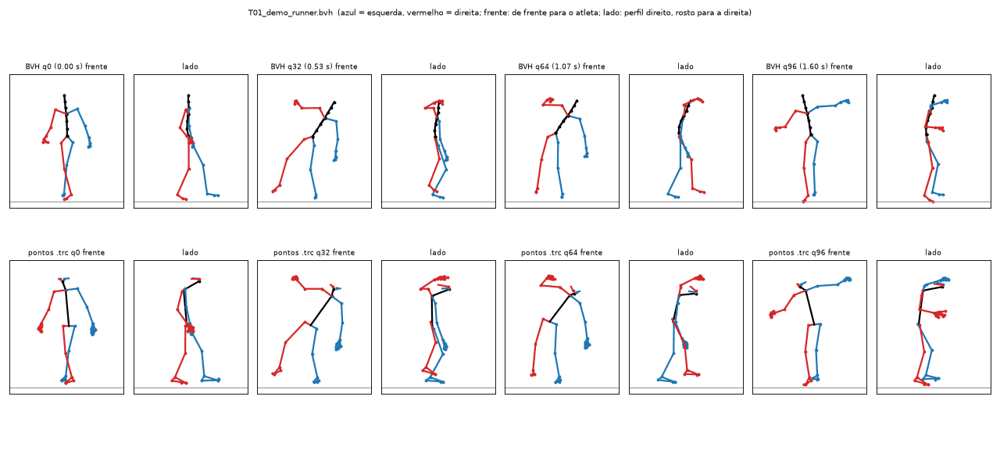
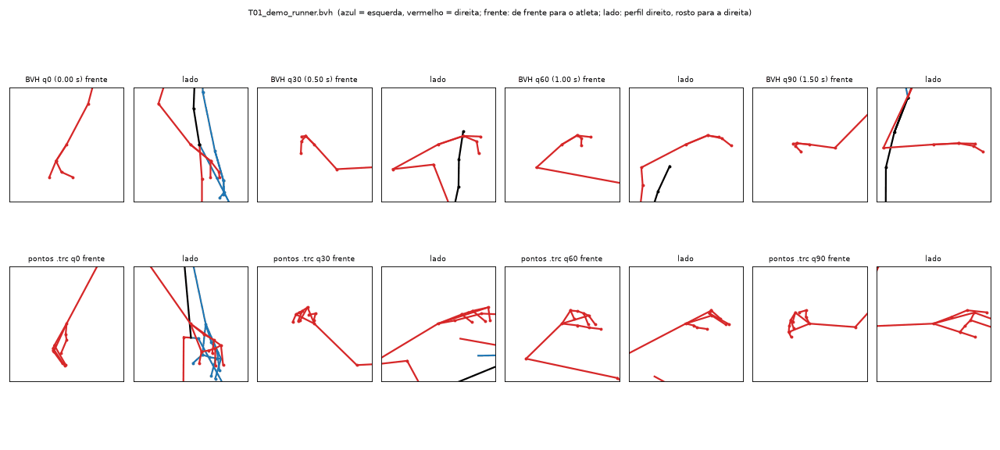
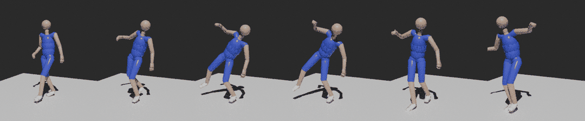

# Captura própria com celulares (open source, resultado 100% nosso)

Guia prático para gravar os atletas do diretor e transformar os vídeos em animações do jogo, só com ferramentas
gratuitas e de código aberto (decisão D14). Contexto e armadilhas de licença: `docs/16-pipeline-aberto-visual-e-mocap.md`.
Plano da primeira sessão: `docs/dev/SESSAO-CAPTURA-01.md`.

```
celulares (120 fps) ─► rodar_pose2sim.py ─────────────────────────────────────► pose2sim_para_bvh.py ─► BVH (esqueleto CMU 06)
                       calibração · pose 2D (RTMW, 133 pontos) · sincronia pelo     IK analítica: ossos,      │
                       som · triangulação · filtro · OpenSim IK  (Pose2Sim, BSD-3)  punho/palma pela mão      ▼
                                                                                    Tools/Animacao/montar_personagem_blender.py
                                                                                    → FBX com nomes da Unreal → UE 5.8
```

**A bola não é capturada**: o atleta usa bola de verdade (o movimento sai natural) e o jogo gera a bola sincronizada
com os "empurrões" da mão (o mesmo detector que o jogo já usa; o conversor imprime esses quadros).

## Arquivos desta pasta

| Arquivo | Para quê |
|---|---|
| `instalar.ps1` / `instalar.sh` | Instala tudo num ambiente virtual fora do repositório (Windows / Linux). `-Testar` roda o demo do Pose2Sim |
| `gerar_tabuleiro.py` | PDF do tabuleiro de calibração no tamanho real (A3 ou A2) |
| `Config_garrafao.toml` | Nossa configuração do Pose2Sim (pontos da quadra, modelo, filtro), comentada |
| `rodar_pose2sim.py` | Roda um take inteiro (ou só a calibração) e, opcionalmente, já grava o BVH |
| `sincronizar_audio.py` | Acha o "pulo de sincronia" no som de cada vídeo (usado pelo `rodar_pose2sim.py`) |
| `pose2sim_para_bvh.py` | Converte `.trc` (pontos 3D) ou `.mot` + `.osim` (OpenSim) em BVH no esqueleto do jogo |
| `ver_bvh.py` | Desenha o BVH como boneco de palitos (frente/lado, zoom na mão) para conferir sem Blender |
| `exemplos/` | Imagens da prova feita com o demo do Pose2Sim (ver §9) |

---

## 1. Antes do dia (uma vez)

1. **Instalar no PC** (Windows 10/11, 16 GB de RAM, ~10 GB livres). No PowerShell, dentro de `Tools\Captura`:
   ```powershell
   winget install Python.Python.3.12          # se ainda não tiver Python 3.11/3.12
   powershell -ExecutionPolicy Bypass -File .\instalar.ps1 -Testar
   ```
   O `-Testar` processa o demo de 4 câmeras do Pose2Sim (~3 min) e precisa terminar com "Demo OK".
   Placa NVIDIA (opcional, deixa a pose 2D várias vezes mais rápida): instale CUDA 12 + cuDNN 9 e rode com `-Gpu`.
   Sem GPU funciona: ~4 quadros/s numa CPU de 4 núcleos → um take de 15 s com 4 celulares a 120 fps leva ~30 min
   (deixe processando à noite).
2. **Baixar o esqueleto da CMU** (o conversor usa o `06.asf`; não vai para o git, ver `Tools/Animacao/README.md`):
   ```powershell
   Invoke-WebRequest http://mocap.cs.cmu.edu/subjects/06/06.asf -OutFile $env:USERPROFILE\garrafao-captura\06.asf
   ```
3. **Imprimir o tabuleiro**: `python gerar_tabuleiro.py tabuleiro_A3.pdf` (ou `--papel A2 --casas 7x10`).
   Imprimir em **tamanho real (100%)**, colar numa placa **rígida e plana** (MDF ou foam board), medir uma casa com
   régua e conferir o valor em `intrinsics_square_size` do `Config_garrafao.toml` (A3 = 47 mm).
4. **Termo de cessão** de imagem e movimento (doc 16 §4.5) para cada atleta: uso comercial em jogo e divulgação,
   opção de anonimato; menor de idade assina com o responsável. **Sem termo assinado, não grava.**
5. **App de câmera** em todos os celulares: **Blackmagic Camera** (grátis, Android e iOS) ou o modo "Pro" nativo,
   desde que permita travar obturador, ISO, foco e balanço de branco e gravar a fps **constante**.
6. Ensaiar em casa com 2 celulares e 1 take (montagem + calibração + processamento) antes do dia da quadra.

## 2. Equipamento

| Item | Quantidade | Observação |
|---|---|---|
| Celulares | **4** (mínimo 2) | Podem ser modelos diferentes; cada um precisa da própria calibração de lente |
| Tripés ou pedestais de luz com suporte de celular | 4 | Dois chegando a **~1,2 m** e dois a **~2,2 m** |
| Power banks + cabos | 4 | 120 fps gasta bateria; modo avião ligado |
| Espaço livre | ~2 GB por celular por hora | 1080p a 120 fps ≈ 100–200 MB a cada 15 s |
| Tabuleiro A3/A2 em placa rígida | 1 | §1.3 |
| Trena de 10 m + fita colorida | 1 + 1 | Medir pontos da quadra, marcar o centro e os spots |
| Caixinha de som + app de metrônomo | 1 | Drible no ritmo (§5.4) |
| Etiquetas "cam1"–"cam4" | 4 | Cada celular **sempre** no mesmo tripé/posição |

## 3. Montagem na meia quadra

O volume de captura é a área entre o garrafão e o topo do arco (~6 × 6 m). Marque com fita um **X no centro**:
todo take começa e termina ali.

```
                      CESTA (tabela)
          cam1 ●                              ● cam2      cam1/cam2: diagonais da FRENTE do atleta (ele
         1,2 m  \        [ garrafão ]        /  1,2 m      joga de frente para a cesta), baixas: veem as
                 \                          /               mãos no drible
                  \                        /
                         X  (centro)          ← 5–7 m de cada câmera
                  /                        \
                 /                          \
         2,2 m  /                            \  2,2 m      cam3/cam4: diagonais de TRÁS, altas: veem por
          cam3 ●                              ● cam4        cima do corpo (mão atrás das costas, spin)
                       (topo do arco)
```

- **4 câmeras** nas 4 diagonais (≈ 90° entre vizinhas), a **5–7 m** do X. É o mínimo para "por trás das costas",
  "entre as pernas" e "spin" (a mão some de pelo menos 2 câmeras).
- **3 câmeras**: frente-esquerda, frente-direita e trás (≈ 120° entre elas). **2 câmeras**: só as duas da frente,
  ~90° entre si (serve para drible parado, arremesso e comemoração; perde mão escondida).
- **Alturas misturadas** (1,2 m e 2,2 m) melhoram a triangulação. **Nada de câmera vista de cima.**
- **Celular deitado (paisagem)**, lente **1×** (a principal; a grande-angular distorce demais), **sem zoom**.
- Enquadramento: no ponto mais alto do pulo (braço esticado na bandeja) o atleta ainda cabe com folga, e ocupa
  **pelo menos 1/3 da altura** do quadro parado. Confira com o atleta pulando no X antes de travar os tripés.
- Depois de calibrar, **ninguém encosta nos tripés**. Se alguém esbarrar: refaça só a extrínseca (§4.2) daquela sessão.
- Ninguém além do atleta dentro do quadro durante o take (operador e ajudante atrás das câmeras).

## 4. Configurar os celulares e calibrar

### 4.1 Configuração (igual em todos)

| Ajuste | Valor |
|---|---|
| Resolução / fps | **1920×1080 a 120 fps** (60 fps só se faltar luz; nunca menos) |
| Obturador | **1/1000 s** (no mínimo 1/500): a mão do drible não pode borrar |
| ISO, balanço de branco | Manuais e **travados** (ajuste com o atleta no X) |
| Foco | Manual/travado na distância do X |
| Estabilização, HDR, "embelezar" | **Desligados** (a estabilização estraga a calibração) |
| Taxa de quadros | **Constante** (no Blackmagic Camera é o padrão; o app nativo às vezes grava variável) |
| Áudio | **Ligado** (é como sincronizamos) |
| Modo avião / não perturbe | Ligado |

**Luz**: de dia ao ar livre (céu nublado é o melhor) ou ginásio bem iluminado, **sem contraluz**. Teste de flicker:
grave 5 s a 120 fps e veja se a imagem "pisca"; se piscar, troque de quadra/horário ou use 1/100 ou 1/120 s
(compromisso: borra mais a mão).

### 4.2 Calibração

Estrutura de pastas da sessão (o nome dos celulares é sempre `cam01`…`cam04`):

```
D:\Captura\S01\
  calibracao\calibration\intrinsics\cam01\tabuleiro.mp4   (… cam02, cam03, cam04)
  calibracao\calibration\extrinsics\cam01\quadra.mp4      (… cam02, cam03, cam04)
  T01_drible-parado_D_120\videos\cam01.mp4                 (… cam02.mp4, cam03.mp4, cam04.mp4)
  T02_drible-parado_E_120\videos\cam01.mp4 …
```

1. **Lente (intrínseca), 1 vez por celular** (refazer só se mudar resolução, lente ou zoom): com a mesma
   configuração da gravação, filme ~40 s mostrando o tabuleiro a 1–3 m, passando por **todo o quadro** (cantos e
   bordas), inclinado até ~45°, devagar (sem borrar), o tabuleiro sempre inteiro na imagem.
2. **Posição (extrínseca), a cada sessão**, com os tripés já travados: filme **5 s da quadra vazia** em cada celular.
3. **Medir a quadra com trena**: os 12 pontos estão no `Config_garrafao.toml` (cantos do garrafão, pontas do lance
   livre, linha de 3, cantos da tabela) com as medidas FIBA. Confira cada um; se a quadra for diferente, corrija os
   números (metros; origem no chão embaixo do aro, X para a direita de quem olha a quadra de baixo da cesta, Y para
   dentro da quadra, Z para cima). Pontos que não existirem: apague a linha.
4. No PC: `python rodar_pose2sim.py D:\Captura\S01\calibracao --etapas calib`. Para cada câmera abre uma janela:
   aperte **C**, clique nos pontos **na ordem da lista** (botão direito desfaz, **H** pula um ponto que não aparece;
   mínimo 6, ideal 10+), feche a janela. Sai `calibracao\calibration\Calib_scene.toml`.
   O Pose2Sim mostra o erro de reprojeção: ~1 px nas lentes e poucos px nos pontos da quadra está bom; um ponto
   muito fora indica clique errado ou medida errada.

Alternativa sem cliques: o **caliscope** (BSD-2, já instalado junto) calibra com placa ChArUco; depois use
`calibration_type = 'convert'` e `convert_from = 'caliscope'` no Config.

## 5. Gravar

### 5.1 Protocolo de cada take

1. Operador liga os 4 celulares (em qualquer ordem, todos em menos de ~10 s) e fala o nome do take em voz alta
   ("sessão 1, take 3, crossover direita para esquerda"). A bola fica **parada na mão** até depois do pulo.
2. **Pulo de sincronia**: o atleta, no X, pula com os dois pés e **aterrissa batendo forte no chão** (um "tum" alto).
   É por esse som que o `rodar_pose2sim.py` acha o mesmo instante em todos os vídeos (os celulares podem ser ligados
   com segundos de diferença) e alinha as câmeras quadro a quadro. A sincronização automática do Pose2Sim pelo
   movimento erra no drible, que é periódico (ela pode "encaixar" um quique no quique seguinte).
3. Metrônomo começa (se for drible), 4 tempos de contagem, e o atleta faz o movimento.
4. No fim, 1 s parado. Operador para os celulares e anota na planilha.

Takes de **10–20 s**, um movimento por take, **5–10 repetições** de cada lado. Sempre gravar as duas mãos (o
pipeline também espelha, mas a mão fraca de verdade fica mais natural).

### 5.2 Roupa do atleta

**Justa**: bermuda de compressão ou legging e camiseta justa de manga curta, cores que **contrastem** com o piso
e o fundo; tênis de cor diferente da calça. **Nada de regata e bermuda largas** (escondem quadril e joelho),
relógio, boné ou munhequeira grossa. Cabelo preso.

### 5.3 Nomes e planilha

Pasta por take: `T<nn>_<movimento>_<mão>_<bpm>` (ex.: `T05_crossover_D2E_120`). Depois da sessão, copie o vídeo de
cada celular para `videos\camNN.mp4` daquele take (a ordem dos arquivos no celular = a ordem da planilha; o nome
falado no começo do áudio confirma). Planilha: take, movimento, atleta, mão, bpm, repetições, bom/ruim, observação.

### 5.4 Ritmo do drible (o "2K23")

Metrônomo a **120 bpm = 2 quiques/s** (um quique por batida); repetir os dribles principais a **140** e **150 bpm**
(2,3–2,5/s) e o drible baixo/rápido a ~180 bpm. Caixinha de som perto do atleta, volume moderado (o pulo de
sincronia tem que ser mais alto que o clique).

### 5.5 Ordem dos takes (prioridade)

| # | Take | Detalhe | Bpm |
|---|---|---|---|
| 1 | Drible parado, mão D e mão E | Alto e baixo, 15 s cada | 120 / 140 / 150 |
| 2 | Crossover D→E e E→D | Parado e andando | 120 |
| 3 | Entre as pernas (D→E, E→D) | Parado e recuando | 120 |
| 4 | Por trás das costas | Parado e andando para frente | 120 |
| 5 | Spin (para os dois lados) | Saindo do drible lateral | — |
| 6 | Hesitação / in-and-out | Corpo sobe, bola segue, arranca | — |
| 7 | Step-back | Com 1 drible antes | — |
| 8 | Jump shot **spot-up** | Parado, pés posicionados; 8–10× | — |
| 9 | **Pull-up** saindo do drible lateral | O padrão do diretor; último quique → soltura ≈ 0,6 s | — |
| 10 | Bandeja mão forte e fraca | 1 e 2 passos, partindo do X em direção à cesta | — |
| 11 | 4 comemorações (doc 17 §2.3) | **Binóculo de três**, **murro no ar**, **bíceps**, **ombros** (shrug); 5× cada, 2–3 s | — |

Os dedos do "binóculo" saem melhor em pose de mão feita à mão (doc 16 §4.4): na captura, o importante é braço,
tronco e cabeça.

## 6. Processar (no PC)

```powershell
& $env:USERPROFILE\garrafao-captura\venv\Scripts\Activate.ps1
cd C:\caminho\do\repo\Tools\Captura
$calib = "D:\Captura\S01\calibracao\calibration\Calib_scene.toml"
$asf   = "$env:USERPROFILE\garrafao-captura\06.asf"
mkdir D:\Captura\S01\bvh

# um take (drible: filtro de 12 Hz; arremesso/comemoração: 8 Hz)
python rodar_pose2sim.py D:\Captura\S01\T01_drible-parado_D_120 --calib $calib --corte-hz 12 `
       --bvh D:\Captura\S01\bvh\T01.bvh --asf $asf --altura 1.88

# todos os takes da sessão
Get-ChildItem D:\Captura\S01 -Directory -Filter "T*" | ForEach-Object {
  python rodar_pose2sim.py $_.FullName --calib $calib --bvh "D:\Captura\S01\bvh\$($_.Name).bvh" --asf $asf }

# conferir sem Blender (boneco de palitos; --mao r dá zoom na mão direita)
python ver_bvh.py D:\Captura\S01\bvh\T01.bvh D:\Captura\S01\bvh\T01.png --trc (Get-ChildItem D:\Captura\S01\T01*\pose-3d\*_filt_*.trc).FullName
```

No Linux é igual (`source ~/garrafao-captura/venv/bin/activate`, barras `/`). O que conferir em cada take:
`pose\*.mp4` (vídeos com os pontos desenhados: a mão está sendo achada?), `pose-sync\sync_*.png` (picos de
correlação claros), o erro de reprojeção médio da triangulação (bom: < 10–15 px) e o PNG do `ver_bvh.py`.

Se algo der errado: `--sync audio` usa o som só como ponto de partida e deixa o Pose2Sim refinar pelo movimento
(útil se um celular grava o som atrasado em relação à imagem), `--sync gui` abre a janela de sincronia do Pose2Sim,
`--sync nenhum` pula a etapa (vídeos já cortados juntos); `--etapas tri,filtro,ik` refaz só o fim
(a pose 2D, a parte lenta, fica salva); um `Config.toml` dentro da pasta do take muda só aquele take.

Depois: copie os BVH para uma pasta junto dos clipes da CMU e monte o FBX com
`montar_personagem_blender.py -- <pasta_bvh> <saida.fbx> --clipes Hold_Idle,...,T01` (ver `Tools/Animacao/README.md`).
Recortes, loops, espelho e "no lugar" são feitos com as funções do `processar_clipes.py`, como nos clipes da CMU.

## 7. O conversor (`pose2sim_para_bvh.py`)

```bash
python pose2sim_para_bvh.py take/pose-3d/take_filt_butterworth.trc saida.bvh --asf 06.asf            # só pontos 3D
python pose2sim_para_bvh.py take/kinematics/take_filt_butterworth.mot saida.bvh --asf 06.asf \
       --osim take/kinematics/take_filt_butterworth.osim --maos-de take/pose-3d/take_filt_butterworth.trc   # OpenSim + mãos
```

- **Rota `.mot` (recomendada, é a que o `rodar_pose2sim.py --bvh` usa)**: os ângulos do OpenSim são recalculados
  em marcadores do modelo escalado (ossos com comprimento fixo) e as mãos vêm do `.trc`, transladadas para o punho
  do modelo. No demo, o tremor do comprimento dos ossos caiu de ±0,6–1,3 cm para ±0,2–0,4 cm e o deslize do pé
  apoiado de 22,6 para 14,8 cm/s.
- **Rota `.trc`**: só numpy (roda até no ambiente do Blender), útil se o OpenSim falhar.
- Sem otimização: cada osso recebe uma base (eixo do osso + eixo secundário) montada dos pontos, e a mesma base é
  montada no repouso do ASF; a rotação é a diferença. Joelho/cotovelo usam o eixo da dobradiça; coluna e pescoço
  dividem a rotação em 3; o punho (osso `lwrist`/`rwrist` = `hand_l/r` no jogo) é orientado pela **palma** (punho →
  nós dos dedos, indicador → mínimo) quando há pontos da mão (RTMW); a flexão média dos dedos vai para
  `lhand`/`lfingers` e o polegar segue MCP → ponta.
- Saída: BVH a 60 fps, mesma hierarquia e offsets dos BVH do `processar_clipes.py` (os arquivos são comparáveis linha
  a linha), corpo virado para +Z, começando na origem, pés no chão. Imprime tremor dos ossos, deslize dos pés e os
  quadros de "empurrão" do drible de cada mão (para conferir os quiques/s).

### Limitações conhecidas

- **Proporções**: copiamos direções, não posições. Como o esqueleto da CMU tem outras proporções, **o pé pode
  deslizar ou flutuar alguns cm** e a mão não encosta exatamente onde encostava (joelho, bola). Ainda não há trava de
  pé/contato: limpar no Blender ou com o IK da Unreal (foot locking) até fazermos essa etapa.
- **Mãos e dedos**: a 5–7 m a mão tem ~45 px de altura em 1080p e a bola esconde os dedos; a **orientação da palma**
  é confiável quando 2+ câmeras veem a mão; a flexão dos dedos é uma média (o esqueleto só tem 1 osso de dedos +
  polegar). Para a pegada na bola, usar as poses de mão autorais (doc 16 §4.4) por cima.
- **Tremor x atraso**: o filtro Butterworth do Pose2Sim decide. 12 Hz preserva o "empurrão" do drible a 2–2,5
  quiques/s mas treme mais; 6–8 Hz é liso mas arredonda o drible. Mão escondida > 0,2 s fica "congelada" (o
  Pose2Sim repete o último valor): falta câmera naquele ângulo, regravar.
- **Clavículas** presas ao tórax (o "ombros"/shrug perde parte da subida dos ombros); a inclinação da pelve é metade
  da do tronco (não há marcadores de quadril); cabeça pelas orelhas/olhos/nariz (pitch neutro ±10°).
- Com perna/braço quase esticado, a torção vem do pé/tronco (heurística): rotação interna do quadril/ombro em
  pose reta é aproximada.

## 8. Licenças (conferidas em 2026-10-04; conferir de novo antes de lançar)

Nada aqui vai dentro do jogo: são **ferramentas**. O que vai para o jogo são as animações dos **nossos** atletas
(com termo de cessão), que são nossas.

| Componente | Licença | Fonte |
|---|---|---|
| Pose2Sim 0.10.49 | ✅ BSD-3-Clause | [LICENSE](https://github.com/perfanalytics/pose2sim/blob/main/LICENSE) |
| rtmlib 0.0.16 (roda o RTMPose/RTMW) | ✅ Apache-2.0 | [LICENSE](https://github.com/Tau-J/rtmlib/blob/main/LICENSE) |
| MMPose (RTMPose, RTMW, código e pesos publicados) | ✅ Apache-2.0 (Open-MMLab) | [LICENSE](https://github.com/open-mmlab/mmpose/blob/main/LICENSE), [RTMPose](https://github.com/open-mmlab/mmpose/tree/main/projects/rtmpose) |
| OpenSim 4.6 (pacote `opensim` do PyPI, OpenSim Team/Stanford) | ✅ Apache-2.0 | [LICENSE](https://github.com/opensim-org/opensim-core/blob/main/LICENSE.txt) |
| Modelo de corpo do Pose2Sim (adaptado de Rajagopal 2016) | ✅ MIT (modelo original), BSD-3 (Pose2Sim) | [SimTK full_body](https://simtk.org/home/full_body) |
| caliscope 0.11 | ✅ BSD-2-Clause | [LICENSE](https://github.com/mprib/caliscope/blob/main/LICENSE) |
| ONNX Runtime | ✅ MIT | [onnxruntime](https://github.com/microsoft/onnxruntime/blob/main/LICENSE) |
| OpenVINO (CPU) | ✅ Apache-2.0 | [openvino](https://github.com/openvinotoolkit/openvino/blob/master/LICENSE) |
| OpenCV 5 | ✅ Apache-2.0 | [opencv.org/license](https://opencv.org/license/) |
| PyAV (áudio da sincronia) | ✅ BSD-3 (traz FFmpeg LGPL) | [PyAV](https://github.com/PyAV-Org/PyAV/blob/main/LICENSE.txt) |
| PySide6 (janelas do Pose2Sim) | ✅ LGPL-3.0 (só ferramenta, ligação dinâmica) | [Qt for Python](https://doc.qt.io/qtforpython-6/licenses.html) |
| Aumento de marcadores (LSTM do OpenCap) | ✅ Apache-2.0; **desligado** no nosso Config (opcional) | [opencap-core](https://github.com/stanfordnmbl/opencap-core/blob/main/LICENSE) |

⚠️ **Ponto de atenção (risco baixo, mas real): dados de treino dos pesos.** Os pesos são publicados sob Apache-2.0,
mas foram treinados com bases públicas de termos variados. O detector de pessoa padrão (YOLOX "humanart") usa a
**Human-Art**, liberada **só para uso não comercial**
([README](https://github.com/IDEA-Research/HumanArt)); o RTMW ("Cocktail14") e o RTMPose ("Body7") incluem também
AI Challenger, Halpe, UBody, Human-Art etc. Não usamos essas bases nem distribuímos os pesos: só rodamos o modelo
como ferramenta sobre os NOSSOS vídeos. Se o jurídico quiser zerar esse ponto, o primeiro passo é trocar o detector
pelo YOLOX-l treinado só no COCO (link no README do [rtmlib](https://github.com/Tau-J/rtmlib)) via `mode` em
dicionário no Config (exemplo comentado no Config.toml do Pose2Sim).

**Evitados de propósito** (doc 16 §2): nada com SMPL/SMPL-X/MANO nem treinado em AMASS (o Pose2Sim tem um
`Markers_SKEL.xml`, que é do modelo SKEL, baseado em SMPL: **não usar**), OpenPose (não comercial), Ultralytics/YOLO
(AGPL).

## 9. Prova feita aqui (demo do Pose2Sim, sem atletas nossos)

Rodado em Linux (4 vCPU, sem GPU) em 2026-10-04 com Pose2Sim 0.10.49, rtmlib 0.0.16, OpenSim 4.6, Python 3.11 e 3.12,
sobre o `Demo_SinglePerson` do Pose2Sim (4 câmeras, 1080×1920, 60 fps, 1,6 s de um movimento de equilíbrio):

| Etapa | Resultado |
|---|---|
| Calibração | Conversão Qualisys (RMS 0,17–0,24 px). Intrínseca recalculada do tabuleiro (imagens **e** vídeo, sem janelas): focal a ±1% da referência |
| Pose 2D | RTMW (`rtmw-dw-x-l`, 133 pontos) na CPU/OpenVINO: 400 quadros em ~1 min 49 s (~4 quadros/s, incluindo baixar o modelo); HALPE 26: ~1 min |
| Sincronia | Automática do Pose2Sim nos vídeos já sincronizados: 0, 0 e −1 quadro. **Pelo som** (padrão): cortamos o começo dos 4 vídeos em 0/12/25/6 quadros (celulares ligados em momentos diferentes) e pusemos um "tum" no áudio: o `--sync som` recuperou exatamente 25/13/0/19 quadros (erro de triangulação 10,3 px, igual ao original); o refinamento pelo movimento (`--sync audio`) errou 1–4 quadros nesse demo sem pulo |
| Triangulação | Erro médio de reprojeção 10,3 px ≈ 19 mm |
| Filtro / aumento | Butterworth (6 e 10 Hz); LSTM do OpenCap rodou (opcional) |
| Cinemática | OpenSim: escala + IK de 97 quadros em ~10 s (`.mot` com 62 coordenadas), com e sem aumento de marcadores |
| Conversor | Direção de todos os ossos do BVH = segmentos do `.trc` (0,0° de erro); hierarquia idêntica à dos BVH do `processar_clipes.py` |
| Blender | `montar_personagem_blender.py --clipes Hold_Idle,Dribble_Idle_R,JumpShot_R,Captura_Demo` → FBX com 31 ossos e as 4 animações; reimportado OK |





O que **não** deu para provar aqui: a calibração extrínseca por cliques na quadra (é interativa; no demo a
extrínseca veio do Qualisys), drible real a 120 fps (o demo não tem bola nem drible) e o `instalar.ps1` (não há
Windows nesta máquina; o `instalar.sh --testar` rodou inteiro, e os scripts Python são os mesmos nos dois). O
ensaio do diretor com 2 celulares (§1.6) cobre os três.

### Observações técnicas

- O Pose2Sim 0.10.49 tem um erro na extração de quadros de vídeo da calibração; o `rodar_pose2sim.py` extrai os PNGs
  antes (por isso `intrinsics_extension = 'png'` no Config).
- O Pose2Sim procura a calibração a partir do `Config.toml`: o `rodar_pose2sim.py` cria um vazio na pasta do take
  (sem ele, o Pose2Sim usaria a pasta atual do terminal) e copia o `--calib` para lá.
- O OpenSim cria `opensim.log` na pasta atual (está no `.gitignore`).
